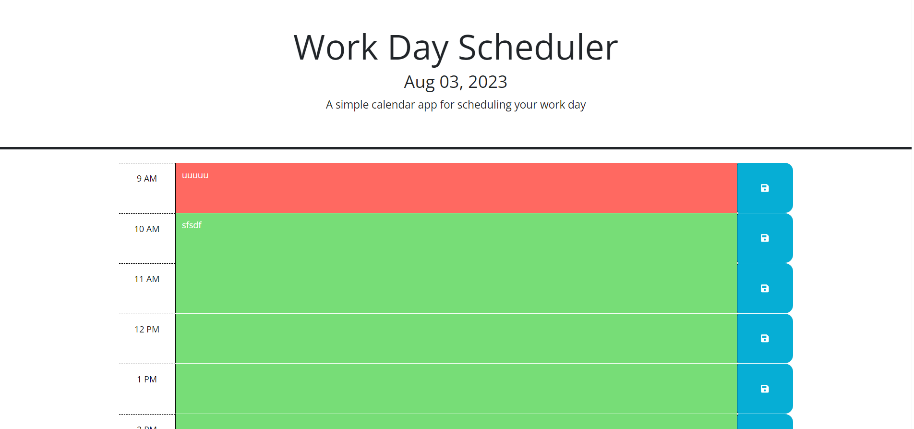

# <Daily Planner>

## Description

This webpage will allow you to act as a daily planner where you can enter events by the hour and saving them to local storage so that they appear the next time you visit the page. In addition, the calender will appear with color coded blocks to let you know which events have already passed, which are currently due, and which will arrive in the future.

This project was designed to test the functionality of dynamically generated web elements and local storage, and also to help keep myself more organized and meet deadline expectations. The color coding provides a simple way to see which events are coming up at-a-glace, and the UI is clean and simple to avoid distraction. 

## Installation

N/A

## Usage

To save a new event, enter the name or description of the event into the hour block for which it will occur and click the blue save button to the right. This will hold the information in storage until the end of the day. The calendar will clear itself at 11PM every night.  

https://brian-wastle.github.io/Daily-Planner/
